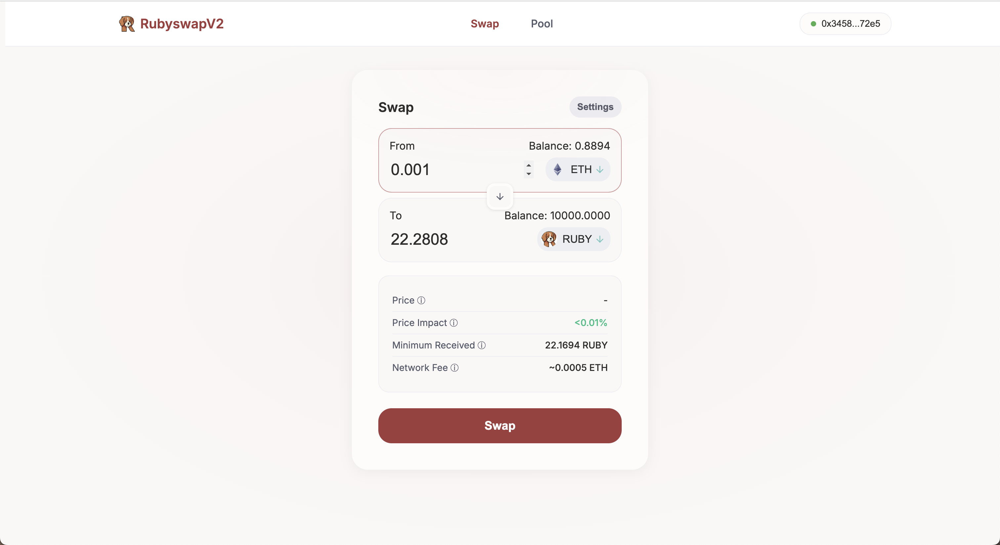

# 🚀 DeFi Learning Portfolio

> A comprehensive collection of DeFi smart contract implementations and frontend applications demonstrating advanced blockchain development skills.

## 📋 Table of Contents

- [Overview](#overview)
- [Projects](#projects)
- [Live Demos](#live-demos)
- [Technology Stack](#technology-stack)
- [Architecture](#architecture)
- [Deployed Contracts](#deployed-contracts)
- [Getting Started](#getting-started)
- [Testing](#testing)
- [Contributing](#contributing)
- [License](#license)

## 🎯 Overview

This repository records my journey through DeFi protocol development, featuring smart contracts and interactive frontend applications. Each project demonstrates different aspects of DeFi including AMMs, yield strategies, stablecoins, and lending protocols.

## 🏗️ Projects

### 1. [Stablecoins](./contracts/01-stablecoins/)
**Status**: ✅ Complete & Deployed

Implementation of two stablecoin architectures:
- **Fiat-backed stablecoin** (USDT/USDC style) with role-based access control
- **Collateralized stablecoin** (DAI style) with ETH collateralization and liquidation mechanisms

**Key Features**:
- ERC20 compliance with 18 decimals
- Role-based access control (admin, minter, pauser, blacklister)
- Price oracle integration for ETH/USD conversion
- Over-collateralization (150%) with 125% liquidation threshold
- 1% stability fee implementation

### 2. [ERC-4626 Yield Vault](./contracts/02-erc4626-vault/)
**Status**: ✅ Complete & Deployed

Standard-compliant yield vault with Aave strategy integration:
- **Full ERC-4626 compliance** for tokenized vault standard
- **Multi-strategy architecture** with Aave lending integration
- **Fee structure**: Management (1%), performance (10%), exit (0.5%)
- **Security controls** with role-based access and emergency pause

**Deployed at**: `0xc9107A0a0684a4DECf1DB0C9e3Fd0f0F04361e66` (Sepolia)

### 3. [RubySwap V2](./contracts/03-dexV2-clone/)
**Status**: ✅ Complete & Deployed

Uniswap V2-style DEX with full AMM functionality:
- **Constant product AMM** (x*y=k formula)
- **Flash swap capabilities** for arbitrage and liquidation
- **Factory and Router pattern** for pair creation and routing
- **Complete trading interface** with MetaMask integration

**Live Demo**: [https://yiannischen.xyz/](https://yiannischen.xyz/)

### 4. [RubySwap V3](./contracts/04-RubyswapV3/)
**Status**: 🔄 In Development

Uniswap V3-style DEX with concentrated liquidity:
- **Concentrated liquidity pools** for capital efficiency
- **Multiple fee tiers** (0.05%, 0.3%, 1%)
- **Non-fungible position management** (NFT-based)
- **Advanced price calculations** with tick-based math

### 5. [Lending Protocol](./contracts/05-lending-protocol/)
**Status**: 📋 Planned

DeFi lending protocol with supply/borrow mechanics:
- **Interest rate models** (linear and exponential)
- **Collateral management** with liquidation mechanisms
- **Supply and borrow operations** with proper accounting
- **Risk management** and safety checks

## 🌐 Live Demos

### RubySwap V2 Interface
- **URL**: [https://yiannischen.xyz/](https://yiannischen.xyz/)
- **Features**: Swap ETH/RUBY, add/remove liquidity, real-time price impact
- **Network**: Sepolia testnet
- **Wallet**: MetaMask integration



## 🛠️ Technology Stack

### Smart Contracts
- **Language**: Solidity 0.8.20+
- **Framework**: Hardhat 4.0+
- **Testing**: Chai + Ethers.js
- **Coverage**: Solidity coverage tools
- **Deployment**: Hardhat Ignition

### Frontend
- **Framework**: React 18+
- **Web3**: Web3-React, Ethers.js
- **Styling**: Styled Components
- **State Management**: React Context + Hooks
- **Build Tool**: Create React App

### Development Tools
- **Package Manager**: npm workspaces
- **TypeScript**: Full type safety
- **Linting**: ESLint + Prettier
- **Version Control**: Git with conventional commits

## 🏛️ Architecture

### Monorepo Structure
```
defi-learning-portfolio/
├── contracts/           # Smart contract implementations
│   ├── 01-stablecoins/
│   ├── 02-erc4626-vault/
│   ├── 03-dexV2-clone/
│   ├── 04-RubyswapV3/
│   └── 05-lending-protocol/
├── frontend/            # React applications
│   ├── 03-rubyswap/    # RubySwap V2 interface
│   └── 04-rubyswap-v3/ # RubySwap V3 interface
├── test/                # Comprehensive test suites
├── scripts/             # Deployment and utility scripts
└── docs/                # Documentation and diagrams
```

### Smart Contract Patterns
- **Factory Pattern**: For DEX pair creation
- **Router Pattern**: For trade execution and routing
- **Strategy Pattern**: For yield vault implementations
- **Access Control**: OpenZeppelin roles and permissions
- **Reentrancy Protection**: Secure external calls

## 📜 Deployed Contracts

| Project | Contract | Address | Network | Status |
|---------|----------|---------|---------|---------|
| **SimpleDollar** | Stablecoin | `0xE2997d5036dF4b7d679C62cc7e87592a81d36768` | Sepolia | ✅ Verified |
| **Price Oracle** | Oracle | `0x81e0Be288ea0b3d5790e631F39cbacF159012F15` | Sepolia | ✅ Verified |
| **Collateralized Stablecoin** | Stablecoin | `0x19858f4fDF9D4451abEC344b5026E27bD4308f39` | Sepolia | ✅ Verified |
| **DAI Yield Vault** | ERC-4626 | `0xc9107A0a0684a4DECf1DB0C9e3Fd0f0F04361e66` | Sepolia | ✅ Verified |
| **Aave Strategy** | Strategy | `0x15D2c56Fe5e62634638292f36DD5E479F16d5B2d` | Sepolia | ✅ Verified |
| **RubySwap V2 Router** | Router | `0x840f42cB68f7bf9E1bEAc7d74fD167E60DAbf2a3` | Sepolia | ✅ Verified |
| **RubySwap V2 Factory** | Factory | `0x85a58B0cDdb9D30c4c611369bC3d4aa1806C6e28` | Sepolia | ✅ Verified |
| **WETH** | Token | `0xbD5eb2A4fBE5a69700470B9913CBfA3C01Bd0A20` | Sepolia | ✅ Verified |

## 🚀 Getting Started

### Prerequisites
- Node.js 18.0.0+
- npm 8.0.0+
- Git

### Installation

1. **Clone the repository**
   ```bash
   git clone https://github.com/yourusername/defi-learning-portfolio.git
   cd defi-learning-portfolio
   ```

2. **Install dependencies**
   ```bash
   npm run install:all
   ```

3. **Set up environment variables**
   ```bash
   cp .env.example .env
   # Edit .env with your private keys and API keys
   ```

4. **Compile contracts**
   ```bash
   npm run compile:all
   ```

### Running Tests

```bash
# Run all tests
npm run test:all

# Run specific project tests
cd contracts/01-stablecoins && npm test
cd contracts/02-erc4626-vault && npm test
cd contracts/03-dexV2-clone && npm test
```

### Deployment

```bash
# Deploy to Sepolia testnet
cd contracts/01-stablecoins && npm run deploy:sepolia
cd contracts/02-erc4626-vault && npm run deploy:sepolia
cd contracts/03-dexV2-clone && npm run deploy:sepolia
```

## 🧪 Testing

Each project includes comprehensive test suites covering:
- **Unit tests** for individual contract functions
- **Integration tests** for contract interactions
- **Security tests** for common vulnerabilities
- **Gas optimization** tests for efficiency
- **Attack simulation** tests for robustness

### Test Coverage
- **Stablecoins**: 95%+ coverage
- **ERC-4626 Vault**: 90%+ coverage  
- **RubySwap V2**: 85%+ coverage
- **Overall**: 90%+ average coverage

## 🔒 Security Features

- **Reentrancy protection** on all external calls
- **Access control** with OpenZeppelin roles
- **Input validation** and bounds checking
- **Emergency pause** functionality
- **Comprehensive testing** including attack vectors
- **Audit-ready** code with clear documentation

## 📚 Learning Resources

This portfolio is based on:
- **Professor Liang Peili's DeFi Course** - Advanced DeFi protocol development
- **WTF Academy** - Solidity fundamentals and best practices
- **Uniswap Documentation** - AMM implementation patterns
- **EIP Standards** - ERC-4626, ERC-20, and other standards

## 🤝 Contributing

This is a learning portfolio, but contributions are welcome:
1. Fork the repository
2. Create a feature branch
3. Make your changes
4. Add tests for new functionality
5. Submit a pull request

## 📄 License

This project is licensed under the MIT License - see the [LICENSE](LICENSE) file for details.

## 🔗 Links

- **Portfolio Website**: [https://yiannischen.xyz/](https://yiannischen.xyz/)
- **GitHub**: [https://github.com/yourusername](https://github.com/yourusername)
- **LinkedIn**: [Your LinkedIn Profile]
- **Email**: [your.email@example.com]

---

**Built with ❤️ and Solidity for the DeFi ecosystem**
