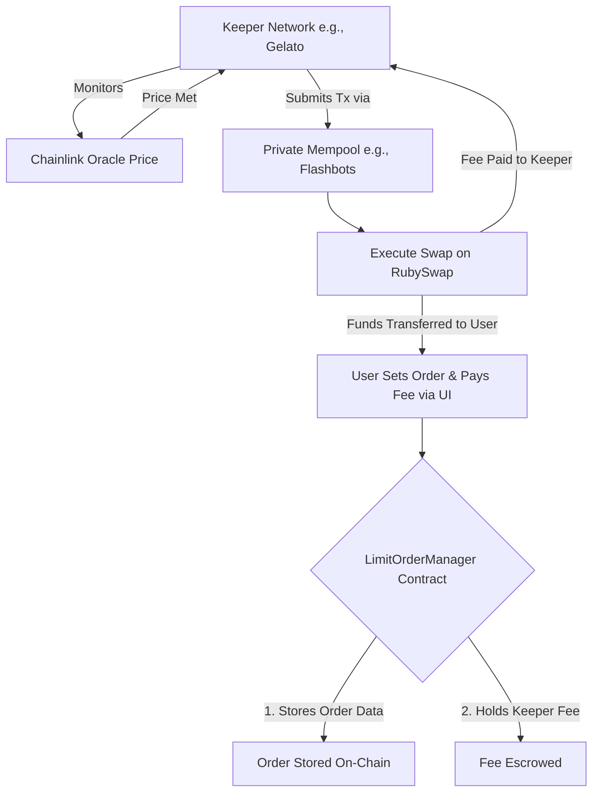
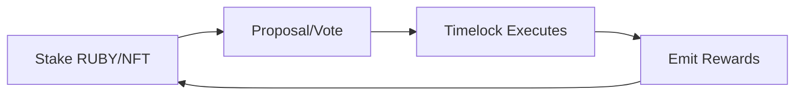

# RubySwap V3 Product Requirements Document (PRD)

## Vision

RubySwap V3 seeks to transform decentralized exchanges (DEXs) by enhancing Uniswap V3's core mechanics with targeted innovations, directly addressing entrenched DeFi pain points. Users face poor UX, including complex bridging requiring multiple wallet confirmations and network switches, often leading to failed transactions and frustration. High gas fees and slippage during volatility or congestion inflate costs, while security risks like phishing, MEV exploitation, hacks (still prevalent in 2025, with millions lost annually), and smart contract vulnerabilities deter participation. Interoperability issues fragment liquidity across chains, complicating trades, and impermanent loss (IL) discourages LPs. For new DEXs, low initial liquidity exacerbates slippage, high fees, and poor adoption, creating a bootstrapping challenge.

The vision for RubySwap V3 is to build a seamless, secure, and highly efficient DEX that methodically solves these problems through a phased, security-first approach, ultimately driving mass adoption through superior user experience and robust liquidity strategies.

## Features (with Prioritization) - Revised Phased Rollout

Our development is now structured into distinct phases to ensure each component is built, audited, and deployed to the highest standard.

### Phase 1: Core DEX Launch (MVP)
- **Concentrated Liquidity Pools**: LPs allocate capital within specific price ranges for maximum fee-earning efficiency.
- **Multiple Fee Tiers**: Three tiers to accommodate different asset types: 0.05% (stablecoins), 0.3% (standard pairs), 1% (exotic/volatile pairs).
- **Non-Fungible Position Management**: LP positions are represented as NFTs (ERC-721), allowing for easy transfer, sale, and visualization.
- **Advanced On-Chain Price Calculations**: Core logic built on tick-based math (price = 1.0001^tick) for gas-efficient and precise swaps, using the internal state for oracle functionality (TWAP).

### Phase 2: Advanced Trading & Incentives (Fast Follow)
- **Limit Orders via On-Chain Manager**: Gas-efficient, MEV-resistant limit orders executed by a professional keeper network (e.g., Chainlink Automation, Gelato).
- **LP Rewards through Yield Farming**: Staking contracts allowing LPs to stake their position NFTs to earn RUBY token emissions.
- **Liquidity Migration Tools & Incentives**: A user-friendly, multi-click UI to enable seamless migration of liquidity from Uniswap V3, coupled with attractive RUBY reward incentives.

### Phase 3: Decentralized Governance
- **Governance System**: A comprehensive governance module, inspired by Compound, allowing RUBY token holders to stake and vote on protocol parameters using a quadratic voting model.

### Postponed / Future Innovation
~~Auto-Rebalancing of Liquidity Positions~~: This feature is tabled for a future release (V3.1) pending further research into gas costs, oracle reliability, and user demand for automated strategies.

## User Stories

### Phase 1
- As an LP, I want to provide concentrated liquidity within a price range I choose to maximize the fees I earn and minimize my impermanent loss.
- As a trader, I want to swap tokens with low slippage and choose pools with appropriate fee tiers for my trade.
- As an LP, I want my liquidity position to be an NFT so I can easily sell it or transfer it to another wallet.

### Phase 2
- As a trader, I want to place a limit order to buy or sell a token at a specific price, so I don't have to monitor the market constantly.
- As an LP, I want to stake my position NFT to earn RUBY rewards, creating an additional yield source to offset potential impermanent loss.
- As a new LP on RubySwap, I want a simple tool to migrate my existing Uniswap V3 positions with just a few clicks to take advantage of new rewards.

### Phase 3
- As a governance holder, I want to stake my RUBY tokens and vote on proposals to have a say in the future direction of the protocol.

**Acceptance Criteria**: UI confirmations, on-chain verifications, error handling (e.g., gas limits). Feedback: Discord betas, post-launch surveys, sprint reviews.

## Non-Functional Requirements

- **Security Standards**: Mandatory dual audits (e.g., PeckShield, Quantstamp) for each phase of deployment. All administrative functions protected by timelocks. Explicit MEV resistance for keepers via private mempool integration (e.g., Flashbots Auction). Emergency pause functionality for critical contracts.
- **Performance**: <200k gas per swap; designed for L2 scalability with a target of 1,000+ TPS; 99.9% uptime with robust monitoring.
- **Interoperability**: EVM-compatible (Ethereum, Polygon, etc.); full support for ERC-20 and ERC-721 standards. Cross-chain strategy via LayerZero.
- **Usability**: Mobile-responsive UI, clear tutorials and documentation, WCAG 2.1 accessibility standards.
- **Liquidity Bootstrapping Mechanisms**: Provide tools and incentives for users to voluntarily migrate liquidity from established DEXs like Uniswap. Offer time-locked migration bonuses and boosted yield farming rewards for early adopters. Form partnerships with new token projects for initial pool seeding.

## Technical Approaches and Architecture

**Tech Stack**: Solidity 0.8.x, Hardhat, React, TheGraph (Custom Subgraph), IPFS.

### High-Level Designs

#### Concentrated Liquidity & Ticks
Unchanged. Price p = 1.0001^tick; positions defined by [lowerTick, upperTick]; swaps update sqrtPriceX96.

#### Limit Orders (Revised)
A LimitOrderManager contract will store order details and a pre-paid fee from the user. This fee covers the keeper's execution gas and incentive. Professional keepers (Chainlink Automation, Gelato) will monitor prices via secure oracles. To prevent front-running, keeper transactions will be submitted through a private mempool (Flashbots).

**Fee Calculation**: The pre-paid fee will be the sum of two components: the estimated network cost and a fixed keeper incentive.

- **Network Cost**: We'll create a view function (estimateExecutionGas) that calculates the gas for a standard swap. The frontend will call this and multiply it by the current gas price, plus a 20% buffer to account for fluctuations.
- **Keeper Incentive**: This will be a fixed premium paid to the keeper, denominated in a stablecoin (e.g., $1.00 of USDC). This ensures keepers have a predictable profit margin.

**Total Fee = (Estimated Gas × Gas Price × 1.2) + $1.00 USDC**

**Order Expiration**: Users must set an expiry timestamp for every limit order. If the order isn't executed before block.timestamp > order.expiry, it becomes inactive. The user can then call a reclaimFee() function to have their pre-paid fee returned to their wallet.

**Partial Fills**: For the initial launch (Phase 2), we will not support partial fills. All limit orders will be Fill-or-Kill (FOK). This significantly simplifies the contract logic, state management, and fee handling. We can explore adding partial fill capabilities in a future V3.1 upgrade based on user demand.

**Keeper Execution Resilience**: If a keeper's executeOrder transaction fails for network-related reasons (e.g., out of gas, temporary L2 sequencer downtime), the order remains active and eligible for execution later. The user's pre-paid fee is only consumed and transferred to the keeper upon the successful completion of the swap. This ensures users are not penalized due to transient network issues outside their control.

#### Yield Farming Rewards
A MasterChef-style contract where users stake their LP NFTs. The reward calculation remains: reward = stakedValue × (emissionRate × timeDelta) / totalStaked.

**RUBY Emission Schedule**: We will use a logarithmic decay model over 48 months to reward early adopters most heavily while ensuring long-term sustainability. The monthly emissions will decrease by a fixed percentage.

**Formula**: Emissions_Month_N = Initial_Monthly_Emission × (0.95)^(N-1)

This creates a predictable and transparent emission curve that favors long-term protocol health.

**Handling Multiple Fee Tiers**: Rewards will be calculated based on the Total Value Locked (TVL) in USD of the staked position, not just the quantity of tokens. This normalizes rewards across all pools and fee tiers. Our staking contract will use our oracle system to price the underlying assets in the LP position to determine its USD value for reward calculations.

**Oracle System Consistency**: All on-chain calculations that depend on the real-time price of an asset, whether for limit orders or for determining the USD value of staked LP positions for yield farming rewards, must use our single, approved oracle system (Chainlink-primary/TWAP-fallback). We will not maintain two separate oracle systems. This ensures reward calculations are as secure as our core trading functions and prevents potential attack vectors to unfairly drain the rewards pool.

**Lock-up Periods**: Yes, we will offer optional lock-ups to incentivize long-term liquidity.

- **Flexible Staking**: 1x base reward multiplier.
- **30-Day Lock**: 1.5x reward multiplier.
- **90-Day Lock**: 2.0x reward multiplier.

This structure rewards commitment and helps create a stable liquidity base.

#### Governance (Revised Tokenomics)
RUBY token allocation will be defined as: 60% Community Incentives, 15% Treasury, 15% Core Team (vested), 10% Investors (vested). Quadratic voting power calculated as √stakedRUBY.

**Timelock Security**: The governance framework must enforce a minimum 48-hour timelock between a proposal successfully passing a vote and its execute() function becoming callable. This "cool-down" period is a fundamental user protection mechanism that ensures the community has adequate time to review the code of any passed proposal before it becomes active, protecting the protocol from malicious governance takeovers.

#### On-Chain Price Calculations
Hybrid model using primary, battle-tested Chainlink feeds for key assets. The protocol's internal TWAP (observe) will serve as a fallback and for assets without a direct Chainlink feed.

**Chainlink Integration**
- **Specific Asset Feeds**: For Phase 1, we will only permit the creation of pools where both assets have a direct, battle-tested Chainlink price feed on our target L2. This includes major assets like: ETH, WBTC, USDC, USDT, DAI, and LINK.
- **Assets without Chainlink Feeds**: These assets can exist on the DEX for standard swaps, but they will be ineligible for features requiring a high-security oracle (e.g., triggering limit orders, being used as collateral in yield farms). This is a critical security-first approach.
- **Deviation Threshold**: The system will check for price deviations between the Chainlink feed and our internal 30-minute TWAP. If the deviation exceeds 3%, the system will enter a "safe mode," temporarily pausing limit order executions for that specific market until the deviation is resolved.

**TWAP Fallback**
- **Observation Window**: We will use a 30-minute observation window for our Time-Weighted Average Price (TWAP) calculations. This is a widely accepted industry standard that makes short-term price manipulation extremely expensive and difficult.
- **Manipulation Prevention**: Our primary defense is requiring deep liquidity for any pool used in the oracle system, which makes manipulation costly. The 3% deviation check against the Chainlink price is our secondary, active defense mechanism.

#### Liquidity Migration (Revised)
This is a user-initiated process, not a "fork." The UI will offer a simple 3-click flow: 1) Connect Wallet & Detect Positions, 2) Select Positions to Migrate, 3) Approve & Execute a single, batched transaction that withdraws from Uniswap and deposits into RubySwap.

**Migration Incentives**
- **RUBY Bonuses**: We will allocate 5% of the total RUBY supply to a 90-day "Liquidity Genesis" event. Bonuses will be distributed as a direct airdrop proportional to the USD value of the migrated liquidity and the chosen lock-up period.
- **Time-Lock**: To receive the full RUBY bonus, users must lock their migrated liquidity. Unlocking early will result in forfeiting the unvested portion of the bonus. The bonus RUBY tokens themselves will also vest linearly over 3 months to discourage mercenary farming.
- **Attracting Large LPs**: We will use on-chain analysis tools (like Nansen) to identify top LPs on other platforms. Our BD team will engage them with a "white-glove" service, offering dedicated technical support and the potential for larger, bespoke incentive packages from the treasury allocation for significant, long-term commitments.

**Partnership Strategy**
- **Identifying Projects**: We will actively scout for high-potential projects on launchpads, in developer communities, and among grant recipients. We want to be the go-to liquidity venue for new tokens.
- **Incentives for Seeding**: We will offer a "Liquidity Launchpad" package. In exchange for seeding their primary liquidity on RubySwap, we will provide:
  - A co-incentivized yield farm (they provide their token rewards, we match with RUBY rewards).
  - Co-marketing efforts, including AMAs and social media campaigns.
  - A potential grant from the RubySwap Treasury to further support their growth.

#### Gas Optimizations
Immutable variables, storage packing, diamond proxies for upgrades.

**Target <200k Gas**: This is our "North Star" metric for a standard, single-hop swap of two major ERC-20 tokens. It's ambitious but pushes us to be competitive.

**Assembly Optimizations**: Yes, this is non-negotiable. The core contracts must use assembly for all critical math, memory management, and low-level operations to achieve the lowest possible gas costs.

**Complex Swaps (Multi-hop)**: Multi-hop swaps will be handled by a Router contract, not the core pool contract. While the gas cost will be higher (Hop1 Gas + Hop2 Gas), the router will be optimized to find the most efficient path (balancing gas vs. price impact). The <200k target does not apply to multi-hop swaps.

**Slippage Protection**: The Router contract that facilitates swaps must include parameters for users to set their slippage tolerance. Specifically, the swap functions must accept an amountOutMin (when selling a fixed amount) or amountInMax (when buying a fixed amount) to ensure the trade reverts if the price moves unfavorably beyond the user's defined limit. This is an essential feature for user trust and safety that protects users from receiving a much worse execution price than they anticipated during volatile market conditions.

#### IPFS Usage Clarification
IPFS will be used exclusively for storing the metadata (JSON) and visual assets for the LP Position NFTs, ensuring decentralized and persistent display.

**Data Flows**: User → React UI → MetaMask → Contracts → Chainlink/Uniswap Oracles → TheGraph.

## Mermaid Diagrams

### Limit Order Flow

### Governance & Rewards Flow

## Competitive Analysis

- **Uniswap V3**: Excels in concentrated liquidity/fees but lacks limit orders, rewards, rebalancing, governance, and bootstrapping. RubySwap adds these plus migration tools/oracles for better liquidity/security.
- **SushiSwap**: Yield farming strong but basic vs. V3; no auto-rebalancing/keepers. RubySwap advances with ticks, governance, and aggregator integrations to attract liquidity faster.
- **Compound**: Governance benchmark but lending-focused. RubySwap adapts for DEX, filling gaps in LP incentives and low-liquidity bootstrapping via airdrops/partnerships.

RubySwap stands out by addressing liquidity fragmentation and UX complexity competitors ignore, via innovations and bootstraps.

## Risks, Assumptions, and Mitigations

| Risk | Impact Level | Assumptions | Mitigations |
|------|--------------|-------------|-------------|
| Smart Contract Bugs/Hacks | High | Audits are comprehensive. | Phased rollout to reduce audit complexity. Dual independent audits for each phase; bug bounties; formal verification on critical math; timelocks. |
| Low Initial Liquidity/TVL | High | Incentives attract users. | Targeted migration campaigns with time-locked RUBY bonuses and boosted yield. Partnerships for seeded pools; aggregator integrations. |
| Oracle Manipulation/Failure | High | Chainlink is reliable. | Use only high-quality, existing Chainlink feeds. TWAP fallback; deviation checks between oracles to trigger alerts/pause. |
| Keeper Execution Delays/Failure | Medium | Keepers are reliable. | Use professional keeper networks. Pre-paid execution fees to guarantee incentive. Redundant keeper networks. |
| Regulatory Changes | Medium | DeFi remains accessible. | Decentralized governance for protocol adaptation; ongoing legal counsel. |

## Roadmap - Revised Phased Timeline

The monolithic 8-week timeline is replaced with a more realistic, phased approach.

### Phase 1: Core DEX Launch (MVP) - 12 Weeks
- **Weeks 1-6**: Development of core contracts (Pools, Factory, Ticks, Swap Logic).
- **Weeks 7-10**: Begin parallel audits on immutable contracts. Simultaneously, complete frontend integration and run an incentivized public testnet.
- **Weeks 11-12**: Remediate audit findings, perform final e2e testing, and prepare for mainnet deployment.

### Phase 2: Advanced Trading & Incentives - 6-8 Weeks (Post-Phase 1 Launch)
Development and dedicated audit cycle for Limit Order, Yield Farming, and Migration contracts.

### Phase 3: Governance & Optimization - Target Q2 2026
Development and audit of the full governance module.

## Metrics

Metrics will be tracked according to the phased launch.

### Phase 1 Metrics (First 30 days post-launch)
- **Technical**: 95%+ test coverage; Avg. gas/swap < 180k; 99.99% uptime.
- **Adoption**: Achieve $10M TVL; 5,000 DAU; NPS > 70.

### Phase 2 Metrics (First 30 days post-launch)
- **Innovation-Specific**: Achieve $50M total TVL, with >30% from migration tools. 95%+ limit order fill rate. 80%+ LP retention in yield farms.

### Long-Term (End of Q1 2026)
- **Adoption**: $150M+ TVL; 15k+ DAU.

## Testing & Auditing Strategy

### Audit Timeline
**Parallel Audits**: Yes. For each phase, we will engage two separate, reputable audit firms to work in parallel. This provides a diversity of thought, increases the chances of catching complex bugs, and can help condense the overall feedback and remediation timeline.

**Handling Critical Findings**: Our policy is simple: security is more important than deadlines. If a critical vulnerability is discovered, we will immediately halt the launch countdown. The team will work with the auditors to design and implement a robust fix. The revised code will then undergo a fresh round of review by the auditors. The timeline will be officially extended to whatever is necessary to ensure the protocol is safe. We will never launch with a known critical issue.

## Critical Technical Clarifications

These clarifications address essential security and user protection mechanisms that are mandatory for implementation:

### 1. Limit Order Keeper Failures
**Requirement**: The LimitOrderManager contract must be designed so that if a keeper's execution transaction fails for network-related reasons (e.g., out of gas, temporary L2 sequencer downtime), the order remains active and eligible for execution later. The user's pre-paid fee is only consumed and transferred to the keeper upon the successful completion of the swap.

**Rationale**: Users should not be penalized due to transient network issues outside their control. The system must be resilient to network congestion and temporary failures.

### 2. Yield Farming Oracle Source
**Requirement**: All on-chain calculations that depend on the real-time price of an asset, whether for limit orders or for determining the USD value of staked LP positions for yield farming rewards, must use our single, approved oracle system (Chainlink-primary/TWAP-fallback).

**Rationale**: Using a different, potentially less secure oracle for calculating reward values would create an attack vector to unfairly drain the rewards pool. This ensures reward calculations are as secure as our core trading functions.

### 3. Governance Timelock Duration
**Requirement**: The governance framework must enforce a minimum 48-hour timelock between a proposal successfully passing a vote and its execute() function becoming callable.

**Rationale**: This "cool-down" period is a fundamental user protection mechanism that ensures the community has adequate time to review the code of any passed proposal before it becomes active, protecting the protocol from malicious governance takeovers.

### 4. Slippage Protection for Swaps
**Requirement**: The Router contract that facilitates swaps must include parameters for users to set their slippage tolerance. Specifically, the swap functions must accept an amountOutMin (when selling a fixed amount) or amountInMax (when buying a fixed amount) to ensure the trade reverts if the price moves unfavorably beyond the user's defined limit.

**Rationale**: A DEX without user-defined slippage protection is incomplete and unsafe. This feature protects users from receiving a much worse execution price than they anticipated during volatile market conditions.

## Appendices

### Technical Specifications Summary
- **Gas Target**: <200k gas per single-hop swap
- **Oracle Strategy**: Chainlink primary + 30-minute TWAP fallback
- **Deviation Threshold**: 3% triggers safe mode
- **Limit Orders**: Fill-or-Kill with pre-paid fees
- **Yield Farming**: Logarithmic decay over 48 months
- **Governance**: Quadratic voting with RUBY staking (48-hour timelock)
- **Migration**: 5% RUBY allocation for 90-day genesis event
- **Slippage Protection**: User-defined tolerance with transaction revert on breach
- **Keeper Resilience**: Orders remain active on execution failures
- **Oracle Consistency**: Single oracle system for all price-dependent calculations

### Security Features
- Dual audits for each phase
- Timelocks on administrative functions
- Emergency pause functionality
- MEV resistance via private mempools
- Oracle deviation monitoring
- Safe mode activation for suspicious activity

---

**Document Version**: 1.0  
**Last Updated**: December 2024  
**Next Review**: Before Phase 1 Development Start 